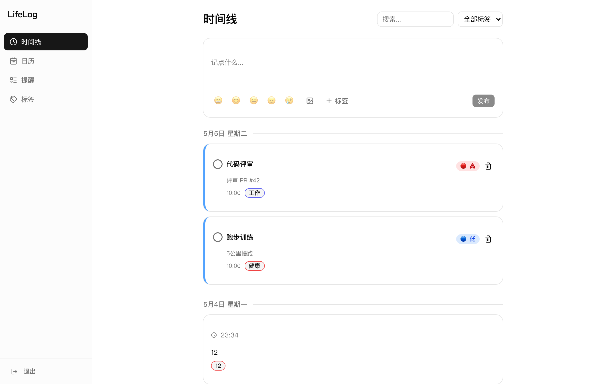
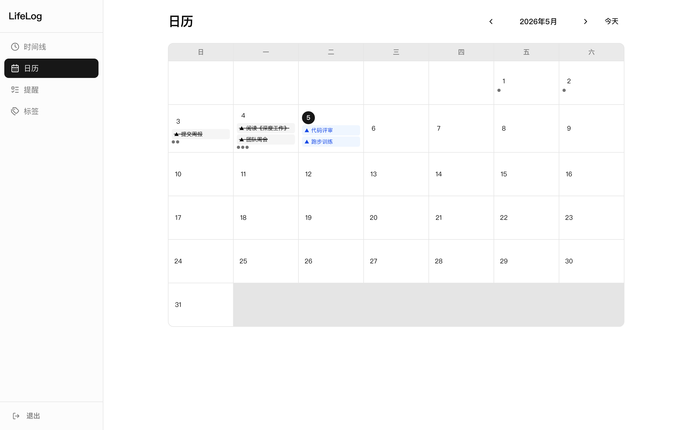
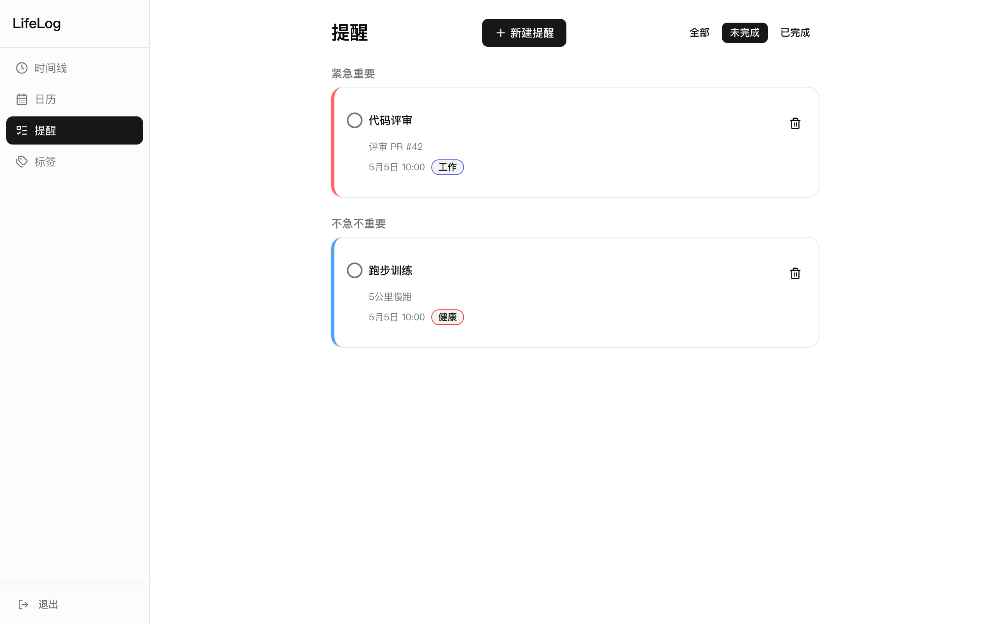
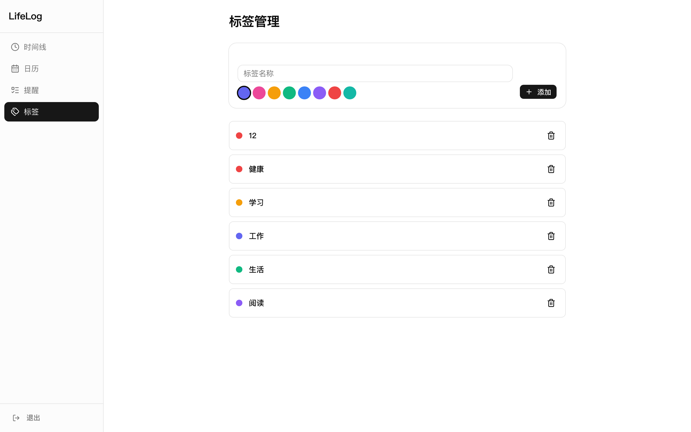
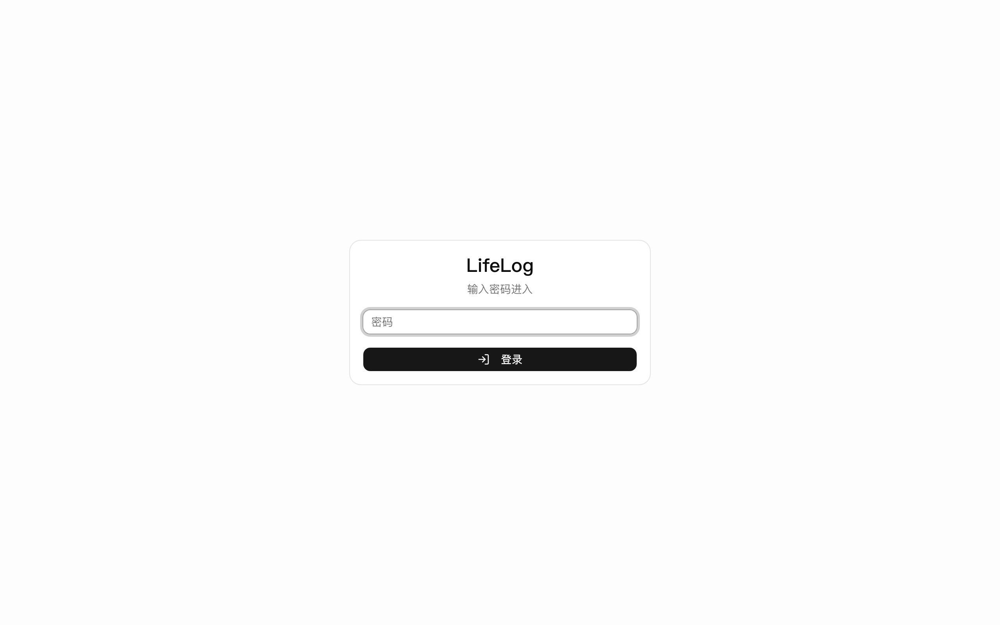

<p align="center">
  
</p>

<h1 align="center">LifeLog</h1>
<p align="center"><b>轻量级生活日志 + 时间管理提醒</b></p>

<p align="center">
  
  
  
  
  
  
</p>

---

## 截图

<p align="center">
  
  
</p>
<p align="center">
  
  
</p>

<p align="center">
  
</p>

---

## 功能

<table>
  <tr>
    <td width="50%">
      <h4>📝 生活日志</h4>
      <p>文字 + 图片，支持心情标记，按时间线展示</p>
    </td>
    <td width="50%">
      <h4>⏰ 提醒/待办</h4>
      <p>四象限优先级管理，到期高亮提醒</p>
    </td>
  </tr>
  <tr>
    <td>
      <h4>📅 日历视图</h4>
      <p>月历展示日志和提醒，点击查看详情</p>
    </td>
    <td>
      <h4>🏷️ 标签分类</h4>
      <p>自定义颜色标签，多对多关联日志和提醒</p>
    </td>
  </tr>
  <tr>
    <td>
      <h4>😊 心情追踪</h4>
      <p>五档心情标记，随笔记录情绪波动</p>
    </td>
    <td>
      <h4>🔍 全文搜索</h4>
      <p>搜索日志和提醒内容，按标签筛选</p>
    </td>
  </tr>
</table>

---

## 时间管理四象限

```
                   重要
                     │
        II           │          I
     计划做          │       马上做
   (中优先级)       │     (高优先级)
                     │
   ──────────────────┼──────────────────→ 紧急
                     │
       IV           │         III
     少做           │       授权做
  (可删除)         │     (低优先级)
```

---

## 快速开始

```bash
# 克隆项目
git clone https://github.com/yourname/lifelog.git
cd lifelog

# 安装依赖
npm install

# 配置环境变量
cp .env.example .env
# 编辑 .env — 设置你的密码和密钥

# 初始化数据库
npx prisma db push

# 启动
npm run dev
```

打开 [http://localhost:3000](http://localhost:3000)，默认密码见 `.env`

---

## 技术栈

| 技术 | 用途 |
|---|---|
| **Next.js 16** | 全栈框架，Server Actions + API Routes |
| **Prisma 6** | 数据库 ORM，自动生成类型 |
| **SQLite** | 零配置单文件数据库 |
| **NextAuth.js** | 密码认证，JWT Session |
| **Tailwind CSS** | 原子化 CSS 框架 |
| **shadcn/ui** | UI 组件库，源码级复用 |
| **date-fns** | 日期处理 |

---

## 部署到 Vercel

[](https://vercel.com/new)

1. 将项目推送到 GitHub
2. 在 Vercel 导入项目
3. 设置 3 个环境变量：

| 变量 | 说明 |
|---|---|
| `ACCESS_PASSWORD` | 登录密码 |
| `NEXTAUTH_SECRET` | 随机密钥 `openssl rand -hex 32` |
| `NEXTAUTH_URL` | Vercel 分配的域名 |

---

## 项目结构

```
src/
├── app/
│   ├── (app)/
│   │   ├── timeline/    # 时间线首页
│   │   ├── calendar/    # 日历视图
│   │   ├── reminders/   # 提醒列表
│   │   └── tags/        # 标签管理
│   ├── login/           # 登录页
│   └── api/             # API 路由
├── components/
│   ├── sidebar.tsx      # 响应式导航
│   └── ui/              # shadcn 组件
├── actions/             # Server Actions
└── lib/                 # Prisma + Auth
```
## 宠物


---

<p align="center">
  <sub>Made with ❤️ | <a href="HOW_TO_BUILD_FAST.md">快速开发方法论</a> | <a href="DESIGN.md">设计文档</a></sub>
</p>
